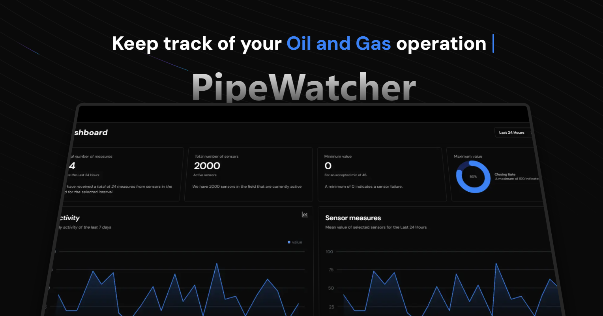
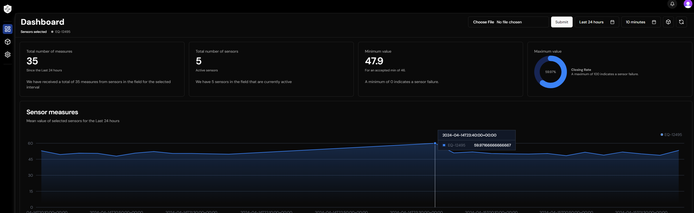
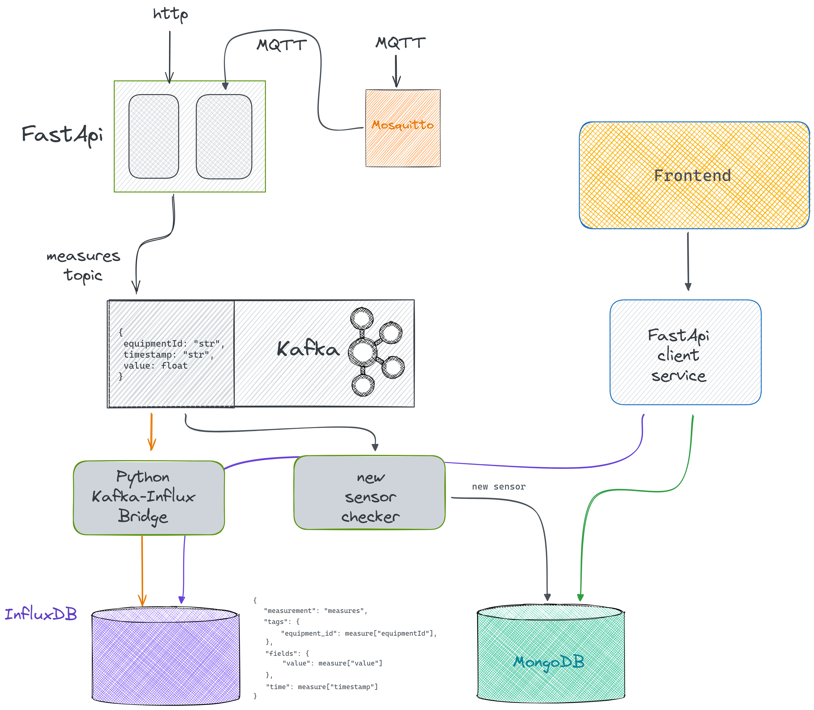
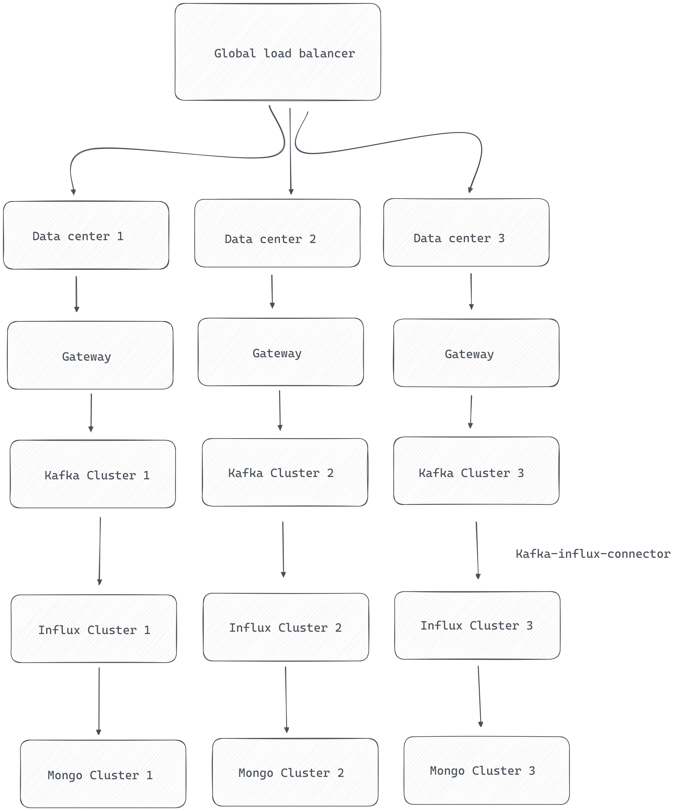

# Solution for the Radix Technical Challenge

## Problema

### Descrição

Você é um desenvolvedor em uma grande empresa do setor de óleo e gás. Uma das plantas dessa empresa instalou sensores em seus 2.000 equipamentos e você foi encarregado de criar a infraestrutura para receber os dados desses sensores em tempo real.

Os equipamentos são capazes de enviar dados no formato JSON para um endpoint. Um exemplo do payload é

```json
{
  "equipmentId": "EQ-12495",
  "value": 78.42,
  "timestamp": "2023-02-15T01:30:00.000-05:00"
}
```

- equipmentId é o identificador do equipamento;
- timestamp é a data e hora que o evento ocorreu, incluindo o fuso horário.
- value é o valor do sensor com a precisão de duas casas decimais.

### Tarefas

- Modele um banco de dados da sua escolha para o caso de uso apresentado;
- Crie uma API com um endpoint que receba as requisições em tempo real e armazene no banco de dados;
- Alguns dos sensores da planta podem apresentar falhas técnicas, resultando em lacunas nos dados. Para lidar com isso, o fornecedor pode enviar arquivos CSV com os dados perdidos. Adicione na API um endpoint que receba um arquivo CSV, realize o parser dos dados e salve os valores no banco de dados. O formato do csv pode ser encontrado na tabela 1;
- Crie uma tela que exiba o valor médio de cada sensor nas últimas 24 horas, 48 horas, 1 semana ou 1 mês. Sua tela deve possuir gráficos para facilitar a análise;
- Crie uma documentação para a sua solução.

Table 1: CSV Format

| equipmentId | timestamp                     | value |
| ----------- | ----------------------------- | ----- |
| EQ-12495    | 2023-02-15T01:30:00.000-05:00 | 78.42 |

### Bônus

- Crie testes de integração e unitários para a solução;
- Crie scripts que automatizem o deploy e execução das aplicações;
- Implemente um mecanismo de autenticação no sistema;
- Crie um relatório de teste de carga para a solução num cenário de 500, 1000, 5000 e 10000 requisições simultâneas.
- Sua solução foi um sucesso e a empresa deseja expandi-la globalmente. Quais componentes extras você adicionaria na solução existente? Desenhe um diagrama para exemplificar a sua proposta de mudança.

### Observações

- O desafio foi estruturado de forma a abranger todos os níveis de senioridade, tente entregar o máximo de features que conseguir, mas entenda que não existe certo ou errado nesse caso. O bônus não é obrigatório, mas a realização dessas tarefas ajuda no processo de nivelamento de senioridades mais altas.
- Recomendamos que a solução seja feita em JavaScript/TypeScript e/ou Python. Mas sinta-se à vontade para utilizar outras tecnologias.
- O projeto precisa estar publicado no seu GitHub, com visibilidade pública. O link deve ser disponibilizado para o RH

## Solução. PipeWacher

A solução foi chamada de PipeWatcher.





### Tecnologias Utilizadas

- Next.js as frontend framework
- TypeScript as frontend programming language
- Prettier / TSLint / ESLint as code linter
- Clerk as authentication service
- Docker as containerization tool
- Docker Compose as container orchestration tool
- Git as version control system
- Python for the backend
- FastAPI as backend framework
- Mosquitto as MQTT broker
- Apache Kafka as message broker
- InfluxDB as time-series database
- MongoDB as NoSQL database

### Arquitetura

- Foi desenvolvida uma solução baseada em microserviços
- Existem 2 endpoints para entrada de dados de sensores, um para MQTT e outro para HTTP
- Foi utilizado Apache Kafka para garantir a escalabilidade e a tolerância a falhas do pipeline de dados
- Foi utilizado InfluxDB para armazenar os dados dos sensores por ser um banco de dados de series temporais altamente otimizado
- Foi utilizado MongoDB para armazenar os dados estáticos dos sensores
- Foi utilizado FastAPI para criar as APIs do cliente

### Fluxo de Dados

**Entrada de dados:**

- Os dados podem entrar na plataforma por meio de dois protocolos: MQTT ou HTTP.
- MQTT é comumente utilizado por dispositivos IoT para enviar dados em tempo real.
- Um serviço FastAPI atua como gateway para as solicitações HTTP e também como consumidor do Mosquitto (broker MQTT).
- O serviço FastAPI valida o formato da mensagem e a envia ao broker Kafka.

**Processamento de dados:**

- O Kafka é responsável por distribuir as mensagens aos consumidores.
- Kafka é altamente escalável e tolerante a falhas, tornando-o ideal para pipelines de dados de streaming de IoT.

**Serviços em Python**

- Existem dois serviços Python
  - Um deles armazena os dados no InfluxDB, um banco de dados de séries temporais otimizado para armazenar dados de sensores.
  - O outro serviço verifica constantemente se há novos sensores no fluxo.
  - Se um novo sensor for detectado, ele será armazenado no banco de dados MongoDB.

**API Cliente (FastAPI):**

- Um terceiro serviço, um FastAPI, funciona como API cliente isolado do pipeline de dados.
- Ele extrai os dados dos bancos de dados (InfluxDB e MongoDB) e os serve ao front-end.
- Isso é necessário porque o front-end não pode acessar diretamente o banco de dados InfluxDB.

**Front-end (Next.js):**

- O aplicativo front-end é construído com Next.js.
- Utiliza Clerk para autenticação.
- O front-end exibe os dados processados e históricos de uso dos equipamentos.



Para expandir a solução globalmente, seria necessário adicionar alguns componentes como load balancers para os serviços encarregados do consumo de dados, evitando bottlenecks. Além disso, teriamos que replicar a infraestura em data centers das diferentes regiões para garantir a disponibilidade e a latência baixa para os usuários.



### Como rodar o projeto

- Clone o repositório
- Execute `docker-compose up` na raiz do projeto ou utilize os arquivos `deploy.sh` e `start.sh`
- Configure o Mosquitto rodando o arquivo `mosquitto\setup_mosquitto.sh` para criar um usuário e senha (radix:123456789)
- Uma vez o mosquitto configurado, pode utilzar o script `mosquitto\dummy_producer.py` para enviar dados via MQTT ao broker
- No `localhost:8090` é possível acessar o painel do UI for Apache Kafka
- Acesse ao painel do InfluxDB em `localhost:8086` com as credenciais do .env, crie o bucket `measures` e copie o token para o .env
- A API do cliente (FastAPI) estará disponível em `localhost:9010`. Acesse a documentação em `localhost:9010/docs` para testar as APIs de extração de dados dos sensores e do arquivo CSV
- Acesse a pasta `frontend` e execute `npm install` e `npm run dev` para rodar o front-end (falta de tempo para configurar o Dockerfile)
- Edite o .env do front-end adicionando as variáveis de ambiente do Clerk (Precisa de uma conta no Clerk para configurar)
- Acesse o front-end em `localhost:3000`.
